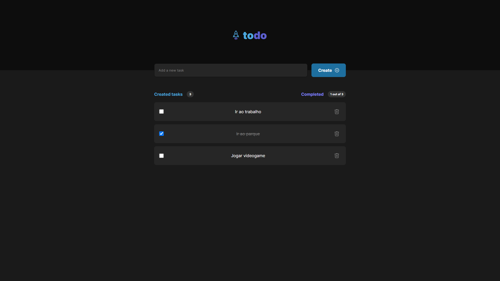
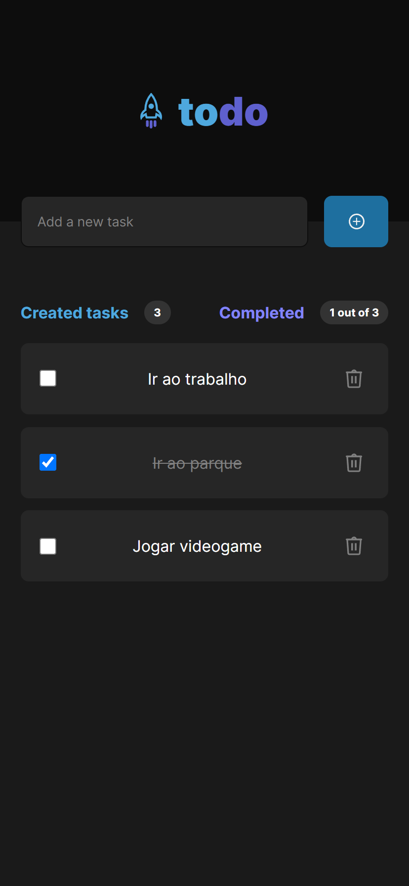

# To do List

To do List feita em ReactJS com sistema de salvamento usando o local storage.

## Indice

- [Visão geral](#visão-geral)
  - [Imagens](#imagens)
  - [Links](#links)
- [Processo](#meu-processo)
  - [Tecnologias usadas](#tecnologias)
- [Author](#contato)

## Visão Geral

### Imagens

#### Desktop

#### Mobile

### Links

- Live Site: [GitHub Pages](https://bruno-oli.github.io/to-do-list/)

## Meu Processo

### Tecnologias

- ReactJS
- HTML semântico
- Flexbox

## Contato

- Twitter - [@realsayden](https://www.twitter.com/realsayden)
- GitHub - [@bruno-oli](https://github.com/bruno-oli)
- Instagram - [@bruno.sayden](https://www.instagram.com/bruno.sayden/)
- Linkedin - [bruno-max](https://www.linkedin.com/in/bruno-max-3665b3223/)